___


## 코로나 시대와 함께하는 국민의 음식 배달 문화 분석 :poultry_leg: :pizza: :meat_on_bone:

> 멀티캠퍼스  '빅데이터 기반 지능형 서비스 개발'  과정에서 진행한 2차 프로젝트입니다
>
> 참여 :  [jaywoong](https://github.com/jaywoong) (기획, 데이터 분석 및 시각화, 머신러닝 구축),  [rcm2000](https://github.com/rcm2000) (웹 구현, 데이터 시각화, DB구축)
>
> 기간 : 2021.08.09 ~ 2021.08.20

	


### :bulb: 최종 구현

### &nbsp;**[기획안](md-images/insight_plan.pdf)**&nbsp; **[결과보고서](md-images/insight_report.pdf)** &nbsp;**[웹페이지](http://cjdauddl93.pythonanywhere.com/)**


###  :pushpin: **Index**

> **:mag: [Overview](#idx1)** 
>
> **:scissors: [Preprocessing](#idx2)**  
>
> **:bookmark_tabs: [Data Analysis and Modeling](#idx3)**
>
> **:bar_chart: [Visualization](#idx4)**
>
> **:package: [Database](#idx5)**

___


## :mag: Overview <a id="idx1"></a>

### :one: 주제

 **코로나 확진자 추이와 음식 배달 주문 데이터를 분석하여 요식업 (예비)창업자에게 도움이 될 수 있는 창업위치선정, 업종선정에 대한 인사이트를 도출하고 원가절감 및 수익 극대화 방안을 분석한다.**   


### :two: 필요성 

 **포스트 코로나 시대가 도래한 지금, 소비자들의 라이프스타일과 소비 패턴이 변화하여 배달음식 시장은 눈에 띄게 성장하였으나, 영세한 자영업자의 영업이익 개선에는 큰 도움이 안되고 있다. 따라서 코로나 확진자 추이와 음식 배달 주문 데이터를 분석하여 요식업 (예비)창업자에게 도움을 주기위해 프로젝트를 기획하였다.**


### :three: 데이터

| 데이터                  | 사이트                                     | 링크                                                         |
| ----------------------- | ------------------------------------------ | ------------------------------------------------------------ |
| 배달 주문 데이터        | Dacon (2021 빅데이터 통신 플렛폼 경진대회) | https://dacon.io/competitions/official/235753/data           |
| 배달 상점 데이터        | KT 빅데이터 플렛폼                         | https://www.bigdata-telecom.kr/                              |
| 서울시 생활 인구 데이터 | 서울 열린 데이터 광장                      | https://data.seoul.go.kr/dataVisual/seoul/seoulLivingPopulation.do |
| 코로나 관련 데이터      | 공공 데이터 포털                           | https://www.data.go.kr                                       |


### :four: 주요 기능

* **창업 위치 선정:round_pushpin:** 
* **업종  선정:dart:**  
* **컨설팅 :gift:** 
* **수요  예측:crystal_ball:** 


### :five: 개발 환경 및 도구

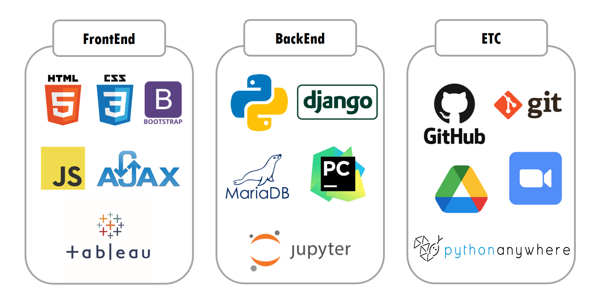

* 분석 라이브러리로는 Pandas, Numpy, Sikit-Learn, KModes, FBprophet이 사용되었습니다.


### :six: 시스템 구조


* Django를 활용하여 MVT패턴의 서버를 구축하였으며, Maria DB와 연동하였습니다.


##  :scissors: Preprocessing <a id= 'idx2'></a>

### :one: 코로나 데이터 가공

```python
df_covid = pd.read_csv('./covid19/Covid19InfState.csv')
df01 = df_covid[['decideCnt','stateDt']] ## 누적확진자와 날짜 컬럼 추출
df02 = df01.astype({'decideCnt': int, 
                  'stateDt': str})
df02['stateDt'] = pd.to_datetime(df02['stateDt'])	## 형변환
j = df02.groupby([df02.stateDt.dt.year, df02.stateDt.dt.month]).last()## 그룹화하여 추출
```

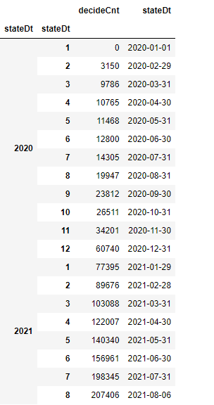

- 그룹화 하여 월별 누적 확진자수로 변환된 모습


### :two:배달 주문 데이터 가공

#### :heavy_check_mark: 코로나에 따른 주문현황 변화 데이터

##### 1. 필요한 데이터 추출

```python
df_del = pd.read_csv('./dlvr_call.csv', low_memory=False)
df_del['PROCESS_DT'] = pd.to_datetime(df_del['PROCESS_DT']) ## 형변환
df03 = df_del['DLVR_REQUST_STTUS_VALUE'] == 1 ## 주문이 완료된 것 검색
df04 = df_del[df03]   ## 주문이 완료된 것만 추출
df05 = df04.groupby([df04.PROCESS_DT]).count() ## 월별 주문 건수 검색
```


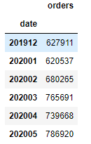


- 월별 주문 건수로 가공된 모습


##### 2. 주문 데이터와 코로나 확진자 데이터 병합(merge) 후 결측치 처리

```python
df6 = pd.merge(df11, df12,left_index=True, right_index=True, how='left')
df_reg = df6.dropna()
```

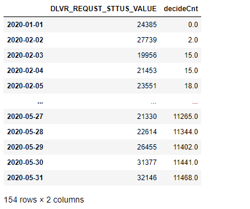

- merge된 후 (월별 주문건수 및 누적확진자 데이터로 가공 완료)


#### :heavy_check_mark: 시간대별 주문현황 데이터

##### 1. 마스크를 이용하여 시간대별(아침, 점심, 저녁, 야간) 분류

 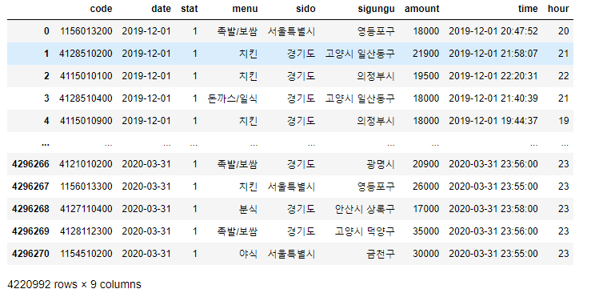

```python
mask = df['hour'].isin([6,7,8,9,10,11]) 
df.loc[mask, 'hour'] = '아침' 
mask = df['hour'].isin([12,13,14,15,16]) 
df.loc[mask, 'hour'] = '점심' 
mask = df['hour'].isin([17,18,19,20,21]) 
df.loc[mask, 'hour'] = '저녁' 
mask = df['hour'].isin([22,23,24,0,1,2,3,4,5]) 
df.loc[mask, 'hour'] = '야간' 
```


​	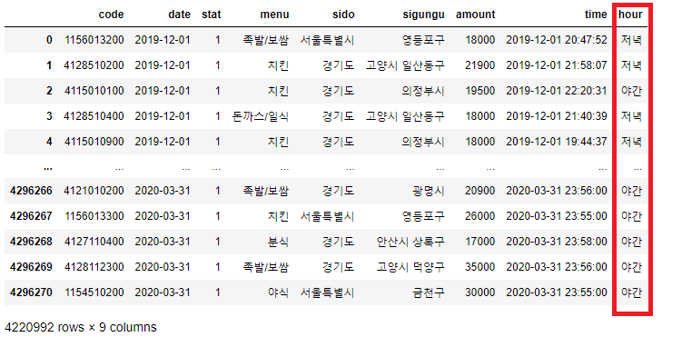

- 기존 데이터를 시간대별로 분류한 결과 


#### :heavy_check_mark: 배달 주문 데이터와 시/군/구 별 인구 데이터 병합

##### 1. 인구데이터 가공

```python
df_pop = pd.read_csv('./pop/LOCAL_PEOPLE_DONG_201912.csv',)
df_pop2 = pd.read_csv('./pop/LOCAL_PEOPLE_DONG_202001.csv',)
df_pop3 = pd.read_csv('./pop/LOCAL_PEOPLE_DONG_202002.csv',)
df_pop4 = pd.read_csv('./pop/LOCAL_PEOPLE_DONG_202003.csv',)
df_pop5 = pd.read_csv('./pop/LOCAL_PEOPLE_DONG_202004.csv',)
df_pop6 = pd.read_csv('./pop/LOCAL_PEOPLE_DONG_202005.csv',)
result = pd.concat([df_pop,df_pop2,df_pop3,df_pop4,df_pop5,df_pop6,])
## 필요 기간별 인구 데이터를 모두 불러온 후 concatenation 하였다.
```
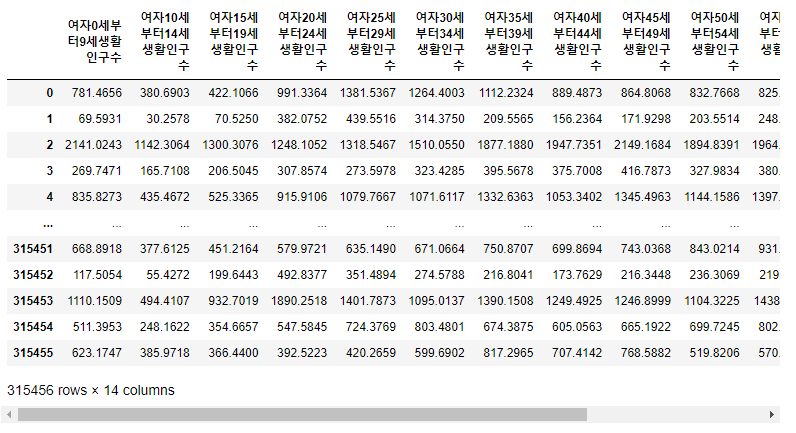


##### 2. Sum 함수를 통하여 간단한 데이터로 변환

```python
ex) a = df_pop2.iloc[:,4:18].sum(axis=1) ## 이러한 코드를 반복적으로 수행하여 가공
```

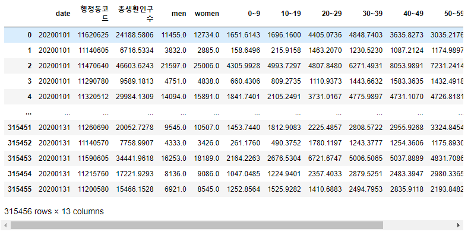

- [date ,행정동코드, 총생활인구수,	men,	women,	0~9,	10~19,	20~29,	30~39,	40~49,	50~59,	60~69,	70~] 으로  컬럼을 분류하여 보기 좋게 병합하였다.


##### 3. 배달 데이터와 병합(merge)

```python
## date(날짜)와 code(행정동코드)의 형을 맞춘뒤 두개의 칼럼 조건으로 조인 시킨다.
df_fin = df.merge(df3, on=['date','code'], how='left')
```

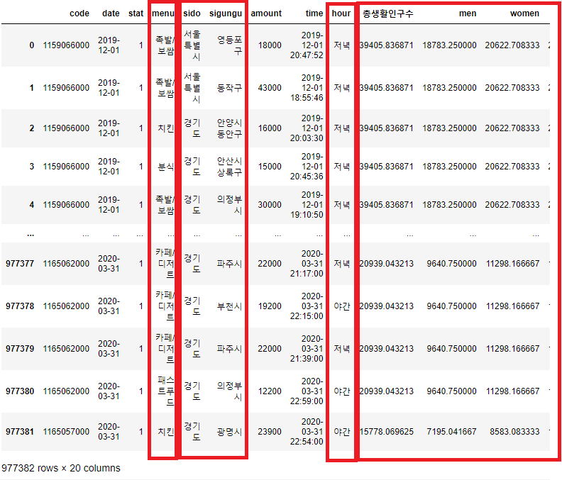

- 날짜별 행정동 코드별로 정확히 구분이 되어야 하기 때문에 이중 조건의 조인을 실시하였다.

  따라서 주문건수 및 위치별 생활인구 수 를 날짜별로 조회할 수 있게 가공이 되었다.


#### :heavy_check_mark: 배달 상점 데이터와 배달 주문 데이터

##### 1. 배달 주문 데이터가 존재하는 배달 상점 데이터 추출

- 배달 주문데이터가 가지고 있는 컬럼인 행정동 코드를 포함한 배달 상점 데이터를 검색하여 받아왔습니다.

  ``` python
  delshop = pd.read_csv('del_shop.csv', header=None)
  delshop2 = pd.read_csv('del_shop2.csv', header=None)
  delshop3 = pd.read_csv('del_shop3.csv', header=None)
  delshop4 = pd.read_csv('del_shop4.csv', header=None)
  delshop5 = pd.read_csv('del_shop5.csv', header=None)
  delshop6 = pd.read_csv('del_shop6.csv', header=None)
  delshop7 = pd.read_csv('del_shop7.csv', header=None)
  delshop8 = pd.read_csv('del_shop8.csv', header=None)
  delshop9 = pd.read_csv('del_shop9.csv', header=None)
  delshop10 = pd.read_csv('del_shop10.csv', header=None)
  
  del_shop = pd.concat([delshop,delshop2,delshop3,delshop4,delshop5,delshop6,delshop7,delshop8,delshop9]) ## 데이터 모두 통합.
  ```

  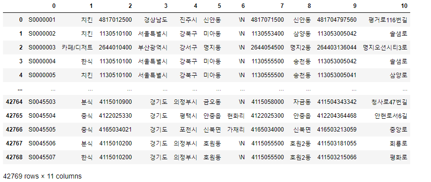


##### 2. 지역별 상점수(공급) 대비 배달 건수(수요)로 경쟁 점수 산출
- 해당 지역의 상점수 (공급) 대비 배달 건수(수요)를 확인하여 점수로 나타내기 위하여 전처리 작업을 실시하였다.

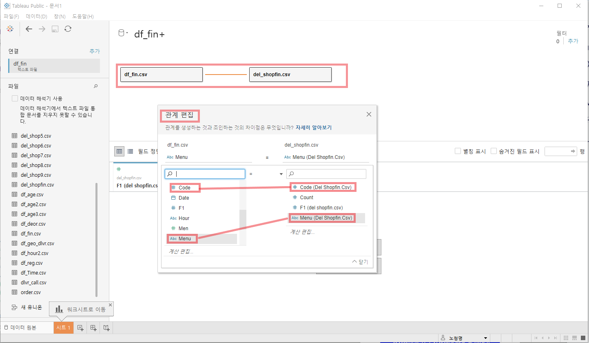

- 번거롭게 조인하지 않고 태블로를 통하여 간단하게 릴레이션을 주어  작업하였습니다
  - 태블로 내에는 조인과 다르게 간단히 두 컬럼을 비교하여 연결시켜주는 릴레이션이 존재합니다. 상단은 배달상점 데이터와 배달 주문 데이터의 `Unique ` 값이 같은 컬럼인 `code` , `menu` 를 릴레이션 걸어주는 모습입니다.

- 작업 후 해당 칼럼을 함수로 계산하여 정규화 및 점수화를 진행하였습니다.

  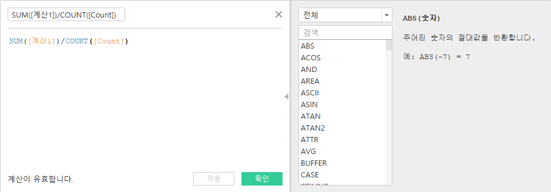

- 총 매출 금액을 로그화 하여 범위를 좁히고 상점의 개수로 나누어 정규화 한 모습

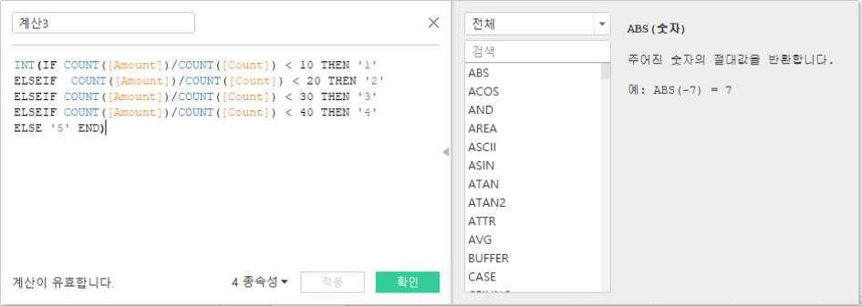

- 정규화 된 자료를 구간별로 점수화 

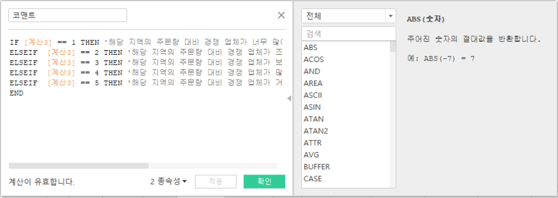

- 점수별로 코멘트를 `if` 문을 통하여 구분하여 달아줌

  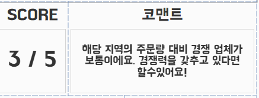

- 웹에 표현된 경쟁 점수


### :three: 시계열 분석을 위한 데이터전처리

##### 1. 주문 시간, 주문 상태 컬럼 선택


##### 2. 배달 상태가 완료인 행 추출

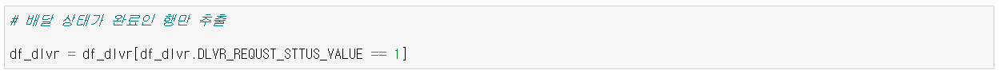


##### 3. 결측치 행 삭제

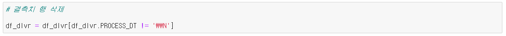


##### 4.주문 시간 시계열 데이터로 변환

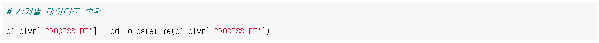


##### 5.날짜별 주문 건수 합계 산출

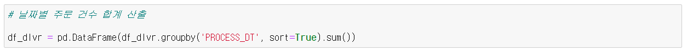


##### 6. 시계열 분석을 위한 데이터 준비 완료

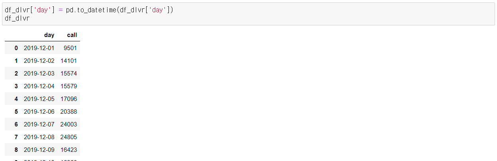

- 시계열 분석을 위한 전처리 완료


### :four: 군집분석을 위한 전처리

##### 1.컬럼 선택 및 추출 

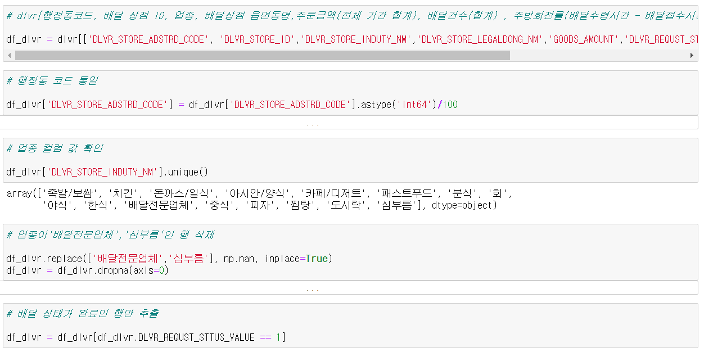


##### 2. 배달접수시간, 배달수령시간 결측치 행 삭제

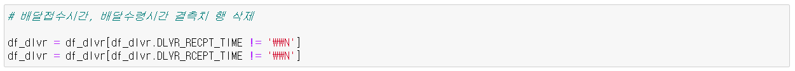


##### 3. 주문 처리 시간 산출(배달수령시간 – 배달접수시간)

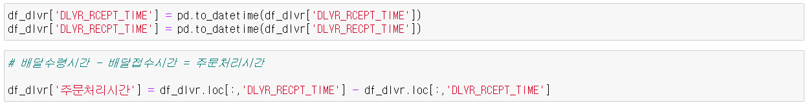


##### 4. 주문 처리 시간을 연속형 변수로 활용하기 위해 초단위로 변경


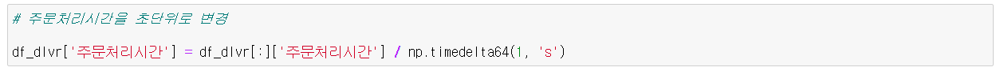

##### 5. 일반적 최소주문금액(5000원) 이하의 주문상품금액 값을 가진 행 제거

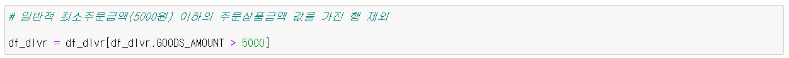


##### 6. 각 컬럼의 상점별 합계 또는 평균 산출

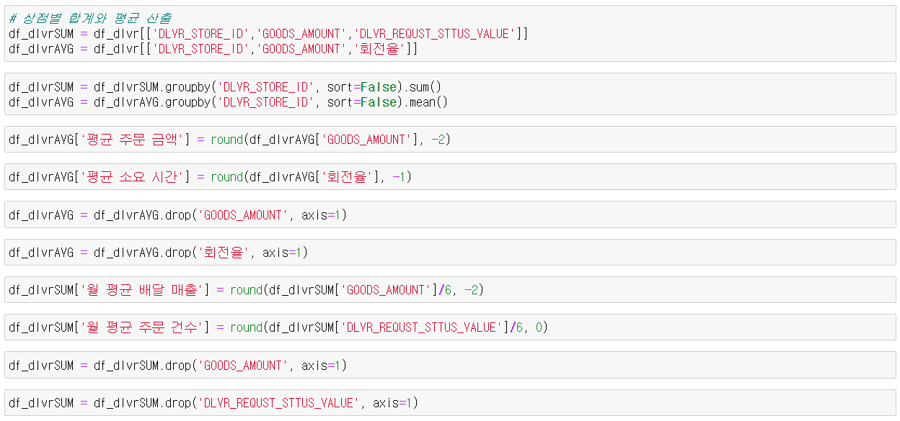


##### 7. 모든 연속형 변수 정수형으로 변환

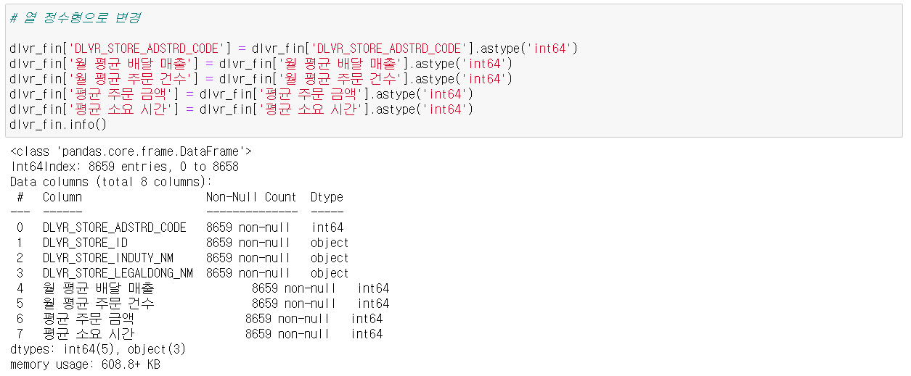


##### 8. 범주형 데이터(행정동 코드, 업종명, 읍면동)와 병합


- 군집분석을 위한 데이터 전처리 완료


## :bookmark_tabs: Data Analysis and Modeling <a id="idx3"></a>

### :one: 시계열분석

##### 1. 모델 비교

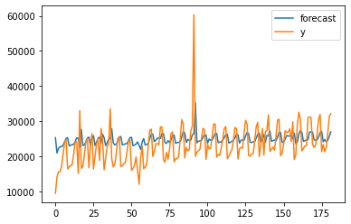

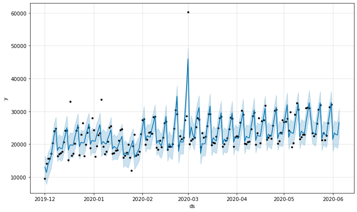

- ARIMA모델(위)과  Facebook의  fbprophet모델(아래)을 활용하여 분석한 결과, 높은 적합도를 보인 fbprophet을 채택하였다.


##### 2. fbprophet 분석 준비

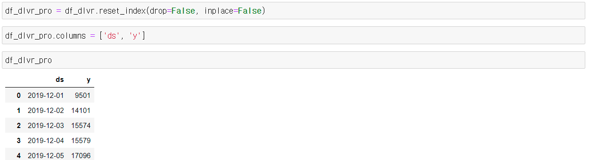

- fbprophet은 ds 컬럼과 y컬럼을 가져야하기에 컬럼명을 변경하였다.


##### 2. 이상치 상한값으로 대체

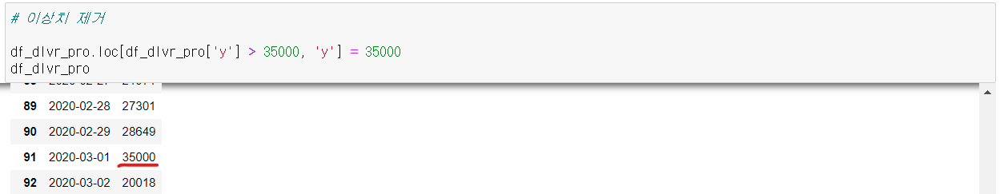

- 92번째 행이 상한값으로 대체되었다.


##### 3. 모델 생성

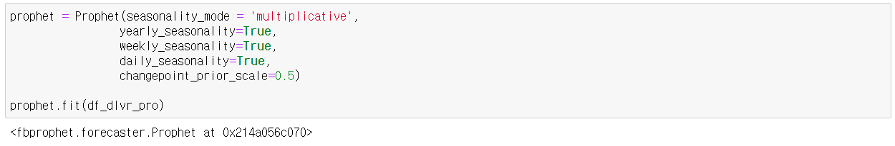


##### 4. 예측 및 모델 확인 

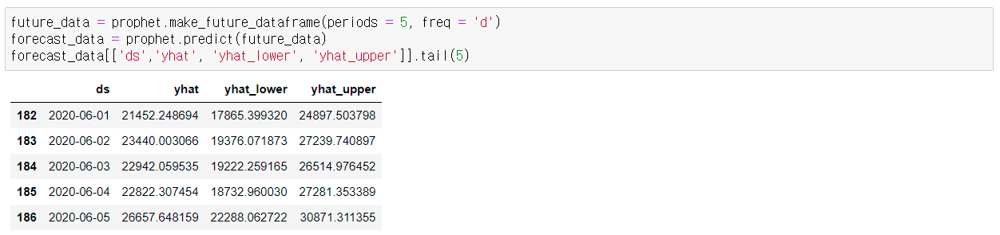


##### 5. 추세 시각화

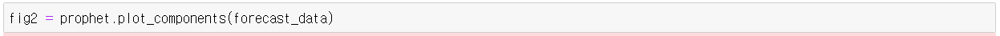


##### 6. 20일 예측

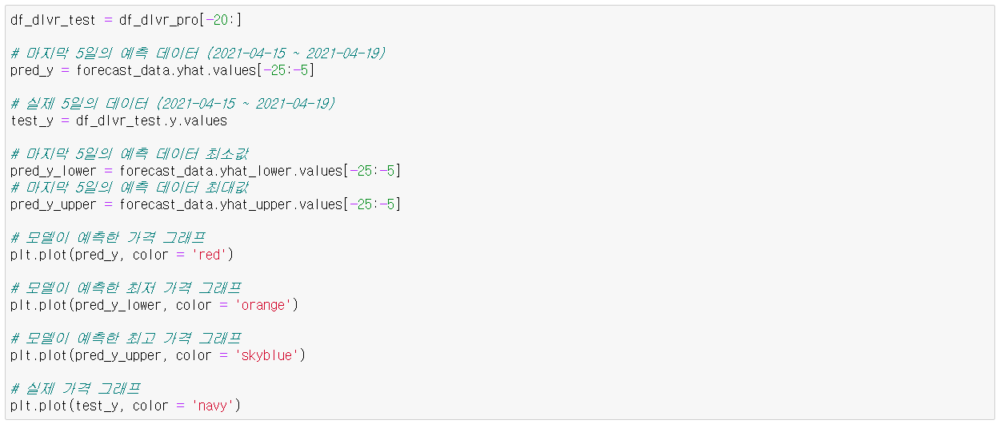


### :two: 군집분석 

##### :point_right: 연속형 변수와 범주형 변수를 모두 사용할 수 있는 K-Modes의  K-Prototypes를 활용하여 비지도학습 군집분석을 수행하였다.

##### 1. 변수 타입 설정

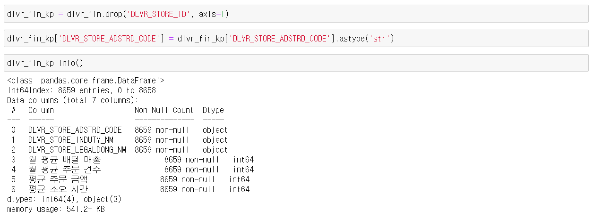


##### 2. 원핫인코딩(더미 변수 생성)

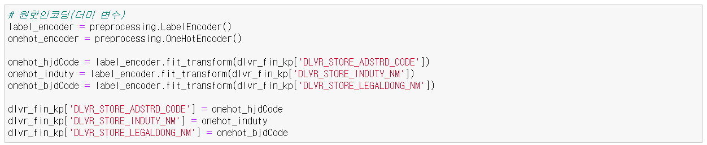


##### 3. 정규화

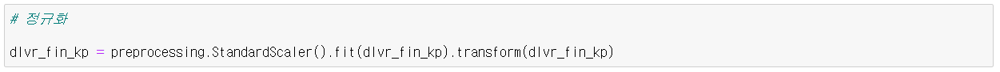


##### 4. 모델생성

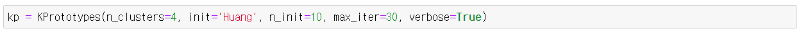

- n_clusters : 군집 수

- n_init : 모델 생성 횟수(기본 값이 10이며, 자동으로 최적의 모델을 선정한다. )

- max_iter : 한 번의 모델 생성시 최대 반복 횟수


##### 5. 모델 적합

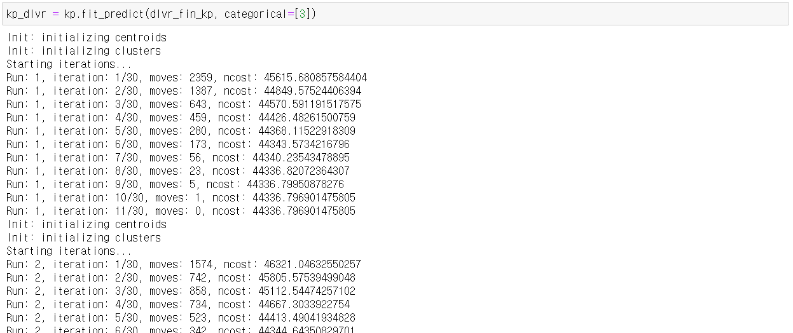


##### 6. 피클 생성

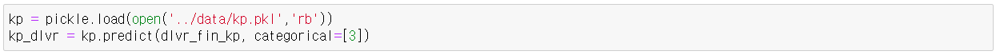

- 학습된 모델을 피클로 만들어 서버에 저장한다.

- 피클을 통해 모델링 과정을 생략함으로써 클라이언트 요청을 빠른 속도로 처리할 수 있다.


##### 7. 군집별 특성 파악

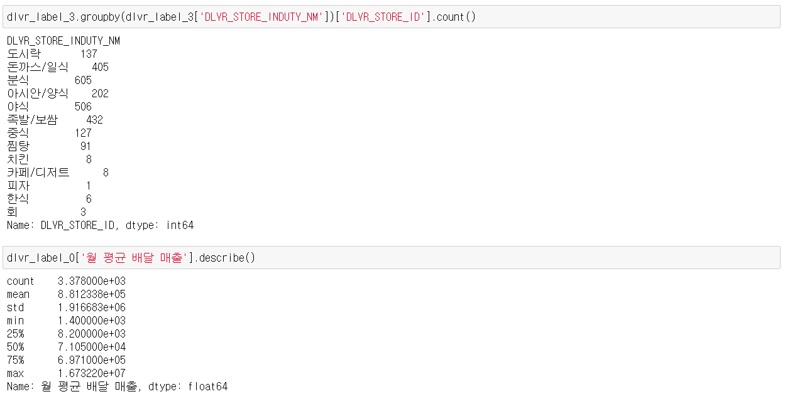

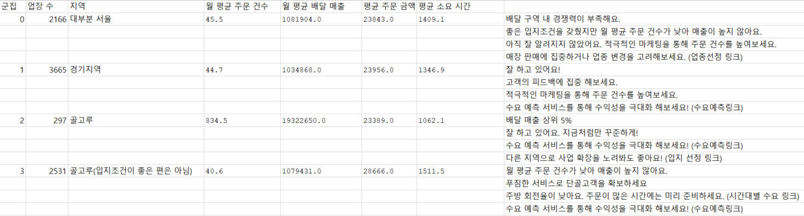

- 통계치를 통해 군집별 특성을 파악하고, 위와 같이 특성에 따른 컨설팅을 제공한다.


##    :bar_chart: Visualization<a id="idx4"></a>

### :one: 데이터 시각화

#### :heavy_check_mark: 시각화 툴 선정


- 저희는 다양한 컬럼과 여러가지 데이터를 활용하여 데이터를 추출하여야 하기 때문에 다양한 데이터를 릴레이션하고 시각화 할 수 있는 툴인 Tableau를 데이터 시각화 툴로 선정하여 작업하였습니다.

  

#### :heavy_check_mark: 태블로 활용 시각화 작업

##### 1. 코로나 증가로인한 배달 주문 변화 그래프

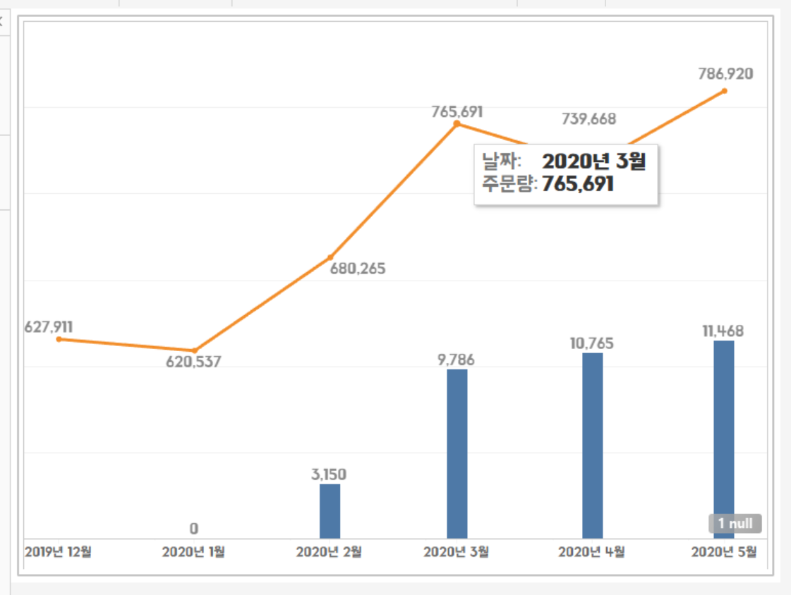

- 코로나 발생 전후로 배달 주문이 크게 상승한것을 확인 할 수 있다.


##### 2. 시간대별 배달 주문 그래프

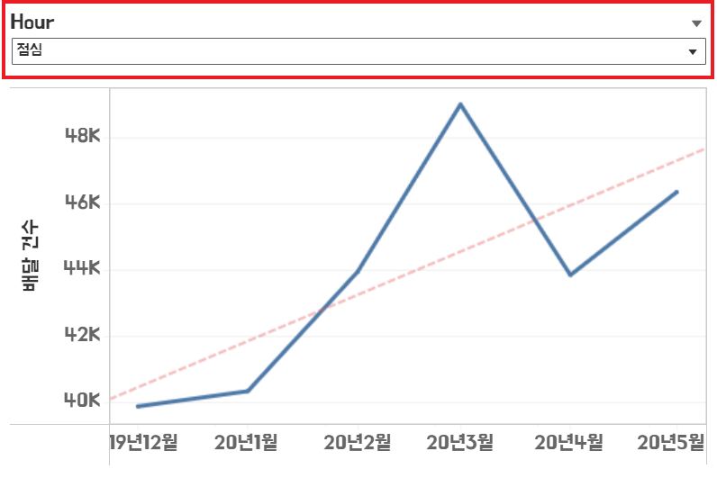

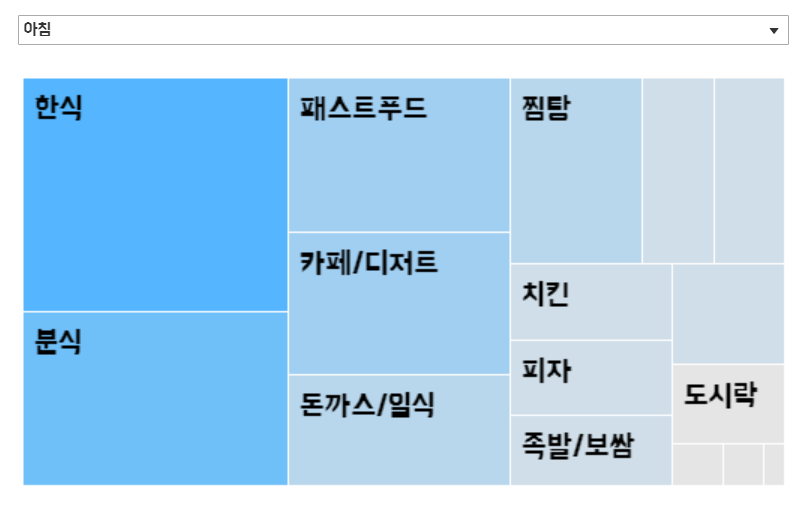

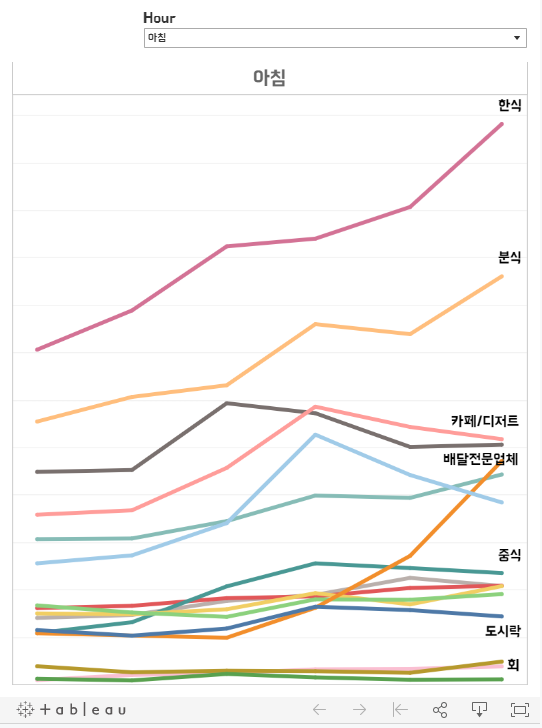

- 시간대(아침 점심 저녁 야간)별로 어떤 업종의 배달 주문이 많이 들어왔는지 또한 어떻게 변화하였는지 한눈에 보기 쉽게 하기 위하여 그래프를 구성 하였다.


##### 3. 위치별 배달 주문 그래프

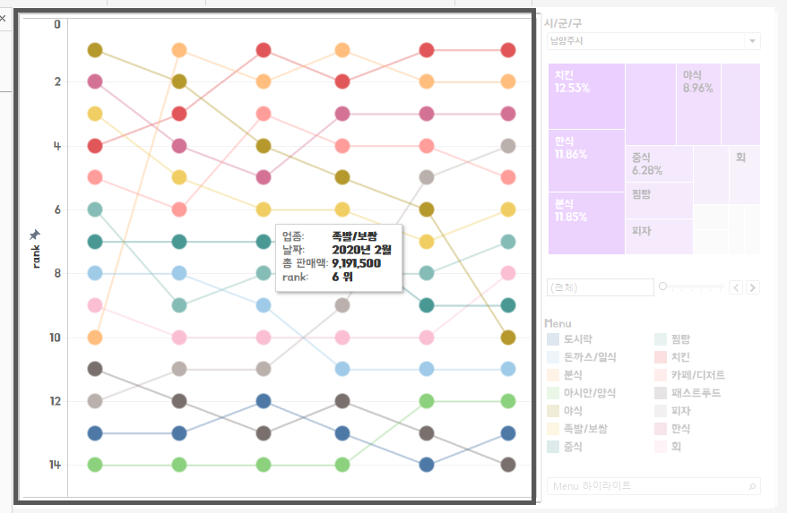

- 시군구별 어떠한 종목이 어떻게 변화했는지 알 수 있다.

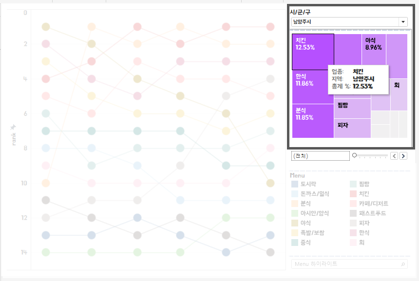

- 종목별 차지하는 비율의 변화도 한눈에 보일 수 있도록 구성.

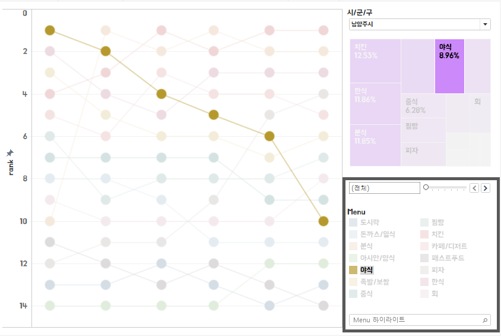

- 한눈에 보기 쉽게 하이라이트를 삽입하여 구성.

  

##### 4. 창업 위치 선정 TIP 대시보드 구성


- 위치별 매출액

  - 위치별로 마우스를 올리면 매출액을 확인할 수 있다.

- 구역별 업종분포

  - 해당 구역의 업종별 매출 분포를 확인할 수 있다.

- 업종별 랭킹

  -  업종별 매출 랭킹 상위 5가지를 한눈에 볼 수 있다.

- 성비

  - 해당 지역의 성비 및 인구수를 확인할 수 있다. 

- 나이분포

  - 해당 지역의 나이별 인구 분포를 확인할 수 있다.

  

- 특정 시/군/구 별 데이터를 검색하여 해당 지역별 데이터를 확인할 수 있도록 하였다.

  

- 더욱 세분화 된 창업 지역 선정을 위하여 서울시의 읍면동 데이터를 불러와 시각화 하였다.

  

- 상단의 위치 찾기를 통하여 위치를 찾을 수 있도록 구성.

  

##### 5. 지역별 업종선정 TIP 대시보드


- 창업 위치 선정에 이어서 업종 선정을 도와주는 탭.

  - 선정한 위치를 검색하고 종목별로 데이터 및 창업 추천 점수를 확인할 수 있도록 구성.


- 위치, 업종별로 대시보드의 제목이 변경되도록 구성.

  

- 창업 SCORE / 코멘트

  - 창업 스코어 : 배달 상점 데이터(공급량) 대비 배달 주문 데이터(주문량 = 수요) 를 정규화 하여 산출해낸 점수이다. 자세한 내용은 전처리 과정 참고.
  - 코멘트 : 해당 점수에 맞는 코멘트를 달아 줄 수 있도록 `if` 문을 사용하여 점수별 코멘트를 작성하여 구성하였다.

- No.1매출/ 건당 평균 매출

  - 지역별 최고 매출 종목 및 선택한 종목의 건당 평균 매출을 확인할 수 있는 탭

- 업종별 랭킹

  - 지역별로 가장 매출이 높은 종목 3가지를 확인할 수 있다.


- 지역별 총 매출

  - 지역별로 총 매출량의 규모를 확인할 수 있다.

- 시간대별 매출 추이 

  - (아침, 점심, 저녁, 야간) 4가지 시간대로 분류된 데이터를 통하여 시간대별로 매출을 확인할 수 있다.

- 요일별 매출 그래프

  - 해당 지역의 선택한 종목의 요일별 매출 그래프를 확인할 수 있다. 
  - 가장 매출이 높은날과 낮은날을 한눈에 볼 수 있도록 구성하였고 코맨트까지 확인할 수 있다.

  

### :two: 웹 구현


#####  1. django 환경 세팅

- 파이썬 프로젝트 생성

  ```
  pip install django ## django 설치
  django-admin startproject config . ## Web Application 환경으로 변환
  python manage.py startapp project01 ## Project 안에 Web Application 생성
  ```

- 기본 setting

  html 폴더 설정 , settings.py 수정, urls.py, views.py 수정


##### 2. bootstrap 선택 및 적용

- https://themewagon.com/  사이트에서 프로젝트에 알맞은 bootstrap 선정

  

- static 폴더 생성 및 bootstrap href 연결

  templates, static 폴더 생성

  mazer에서 제공된 모든 html 파일들을 templates 폴더로 이동시키고, 나머지 소스들은 static 폴더로 이동

  html 및 소스들의 url 연결

  ```
   ## static 폴더 사용
  <link rel="stylesheet" href="../../../../Users/cjdau/Downloads/mazer-main/dist/assets/css/bootstrap.css"> ## 기존 href
  
  <link rel="stylesheet" href="">## 수정 후
  ```


##### 3. 메뉴바 구성


- 주제를 토대로 메뉴바 구성


##### 4. 서비스 화면 구성


- 개요 - 프로젝트의 주제에 맞은 EDA들로 구성 (코로나에 따른 배달 변화, 시간대별, 위치별 배달주문 그래프)


- 창업 위치 선정 - 창업 위치 선정을 위한 데이터 분석 페이지 (창업 위치 선정 대시보드 with tableau)


- 업종선정 - 업종 선정을 위한 데이터 분석 페이지 (업종 선정 대시보드 with tableau)


- 컨설팅 - 군집 분류 머신러닝 모델을 구축하여 자동으로 사용자가 입력한 데이터를 분석하고 해당 데이터에 맞는 tip을 주는 서비스.


- 수요 예측 - 머신러닝 시계열 분석 모델을 활용하여 미래를 예측해볼 수 있는 서비스, 고객이 직접 신청하면 메일로 답을 주는 방식의 서비스.


- About as - 간략한 팀소개 및 팀원 정보.


## :package: Database <a id="idx5"></a>

#### :heavy_check_mark: Maria Db 세팅 및 Model 구축

##### 1. Maria Db 세팅(HeidiSQL)


- 사용관리자명을 project02로 한 전체권한의 사용자를 로컬, 웹 상에서 사용할 수 있도록 세팅


- 세션을 만들고 앞서 만든 사용자 정보를 입력하여 열기

##### 2. DB 모델 구축


- Userdb 데이터 베이스와 user의 테이블을 구축 (id, pwd, name, imgname, email, regdate)를 받을수 있도록 모델을 구축


##### 3. Django와 MVT모델 패턴

- python 내부 db.py 만들고 서버와 연결


- 로컬용 연결 코드 


- Pythonanywhere용 연결 코드() 

- 로그인 회원가입 프로필 수정 페이지 구축


- python 내 Sql class 만들기


- 에러코드 작성


- User class 만들기


- 회원가입 탈되 로그인 프로필수정 등에 필요한 함수들을 정의(update,delete,select 등)


- 로그인 템플릿에 `form` 을 구촉 


- views.py 에 정의한 함수와 sql을 이용하여 form action을 활성화 시킴

##### 4. 로그인 페이지 완성


- 로그인 페이지 - db에 저장된 사용자 데이터를 통하여 로그인이 가능


- 로그인 완료 - 본인이 설정한 이름으로 메뉴바에 사용자명이 바뀜(하단에 drop down도 볼수있도록 구성.)


- Profile 수정 탭 - 로컬 내의 사진을 불러와서 본인의 프로필로 할 수 있도록 설계


- 프로필 페이지 - 수정한 사진과 함께 본인의 이메일 가입일자 등이 보이게 구성

- 정보변경, 로그아웃, 회원탈퇴 기능


- 회원 탈퇴 - 회원 탈퇴 기능(본인의 아이디가 고정으로 입력이 되어 있도록 구성.)
